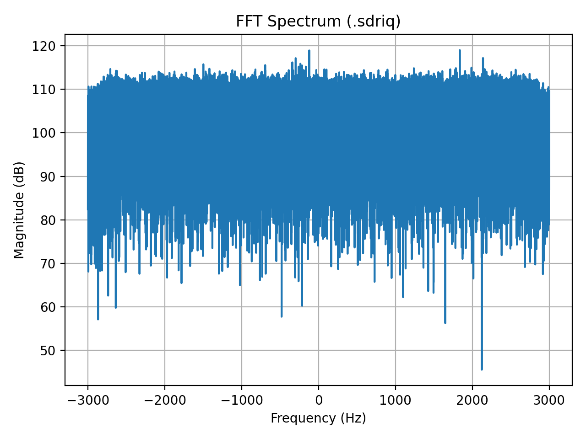

# SDR-FM-Demodulation
SDR project: FM demodulation using Python (FFT + filtering). 
## Goals
- Load recorded IQ samples
- Plot FFT spectrum
- Extract (demodulate) FM audio signal

## Tools
- Python 3.11
- NumPy, Matplotlib

## Progress
- FFT spectrum plot from IQ file
- FM demodulation pipeline
- Save audio (.wav) output

## How to Run
```bash
pip install -r requirements.txt
python fft_spectrum.py
python fm_demod.py
```

## Output

## FM Demodulation
The IQ sample used was a SDRangel radar`.sdriq` recording (not broadcast FM).
So the generated `output.wav` may contain noise/tones instead of music.
This output is included to validate the FM demodulation pipeline.

Generated audio output:
- outputs/output.wav
